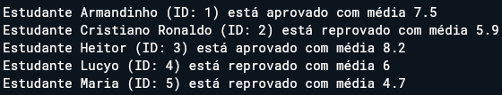
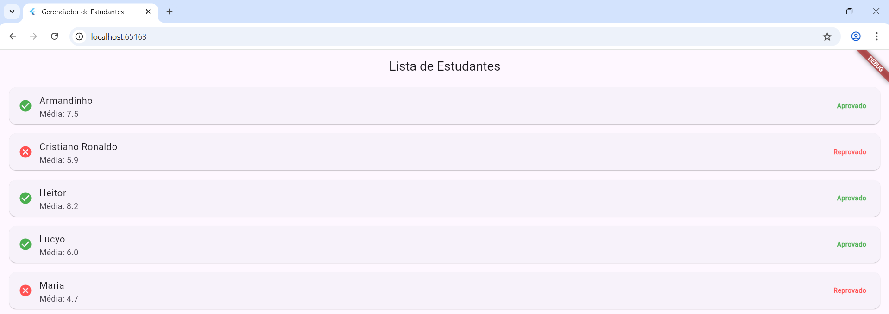
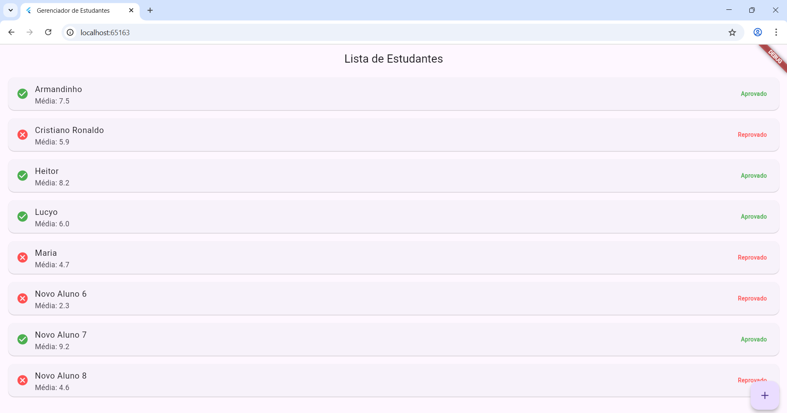

# Avaliação Processual
# PARTE 1
# Gerenciamento de Estudantes - Aplicação Console em Dart

## 📌 Visão Geral

Este projeto foi desenvolvido como uma aplicação console em **Dart** para simular o gerenciamento de dados de estudantes. A lógica do programa é implementada sem a interface gráfica, sendo executada diretamente no terminal. A aplicação faz o gerenciamento da média dos estudantes, exibindo se o estudante está aprovado ou reprovado com base na sua média.

O objetivo desta aplicação é demonstrar o uso de classes, listas, laços de repetição e condicionais em Dart, simulando a lógica de um sistema simples de gerenciamento de estudantes.

---

## 📦 Classe e Atributos

A classe `Estudante` modela um estudante com os seguintes atributos:

- **id** (`int`): Identificador único do estudante.
- **nome** (`String`): Nome do estudante.
- **media** (`double`): Média final do estudante.

A lógica da aplicação é a seguinte:

- Uma lista de estudantes é criada no início, contendo instâncias da classe `Estudante`.
- A aplicação percorre essa lista e verifica se a média do estudante é inferior à nota de corte (7.0).
- Para estudantes com média inferior a 7.0, o status de reprovação é exibido, e para os demais, o status de aprovação.

---

## 🔁 Lógica Implementada

- **Lista de Estudantes**: A lista de estudantes contém 5 instâncias da classe `Estudante`, com diferentes médias de desempenho.
- **Laço de Repetição**: A aplicação utiliza um laço `for` para percorrer a lista e avaliar a média de cada estudante.
- **Condicional `if/else`**: A média de cada estudante é verificada, e uma mensagem é exibida no console indicando se o estudante está aprovado ou reprovado.
- **Exibição no Console**: Para cada estudante, o sistema exibe no terminal o nome, ID e status de aprovação/reprovação.

---

## 💻 Ferramentas e Ambiente Utilizados

- O projeto e aplicação foi feita e executada no navegador no site dartpad.dev

---

## ▶️ Instruções de Execução

**Copie e Cole**:

Abra o site dartpad.dev, copie o código do arquivo parte_1, cole no editor de codigos do site e clique em RUN

---

# PARTE 2

## 📌 Visão Geral

Este projeto foi desenvolvido como uma aplicação **Flutter** para exibir os dados de estudantes em uma interface gráfica. A lógica do sistema foi adaptada a partir de uma aplicação de console, transformando-a em uma aplicação mobile que utiliza **widgets do Flutter** para exibir informações sobre estudantes, como o nome, média e status de aprovação ou reprovação.

A aplicação exibe uma lista de estudantes e seus status de aprovação na tela inicial, utilizando widgets como `Scaffold`, `AppBar`, `ListView` e `ListTile`.

---

## 📦 Classe e Atributos

A classe `Estudante` foi mantida e modela um estudante com os seguintes atributos:

- **id** (`int`): Identificador único do estudante.
- **nome** (`String`): Nome do estudante.
- **media** (`double`): Média final do estudante.

---

## 🔁 Lógica Implementada

- **Lista de Estudantes**: Cinco estudantes são criados na inicialização da aplicação.
- **Verificação de Aprovação**: Para cada estudante, a média é verificada para determinar se ele está aprovado ou reprovado. A média de corte foi definida como **7.0**.
- **Interface Flutter**: A interface exibe a lista de estudantes em uma tela utilizando o `ListView.builder` para renderizar dinamicamente a lista.
- **Ícones de Status**: O status de aprovação é indicado por um ícone de **check_circle** (aprovado) ou **cancel** (reprovado), com cores diferenciadas (verde para aprovado e vermelho para reprovado).

---

## 🖼️ Interface Flutter

A interface foi construída utilizando os seguintes widgets principais:

- **`MaterialApp`**: Define o aplicativo com tema e navegação básica.
- **`Scaffold`**: Fornece a estrutura básica da tela com `AppBar` e `body`.
- **`ListView.builder`**: Cria a lista de estudantes de forma dinâmica.
- **`ListTile`**: Exibe informações de cada estudante, como nome e média, além do ícone de aprovação ou reprovação.
- **`AppBar`**: Exibe o título da aplicação no topo da tela.

---

## 💻 Ferramentas e Ambiente Utilizados

- **Visual Studio Code (VS Code)** como editor principal.
- **Flutter SDK** e **Dart SDK** devidamente instalados.
- A aplicação foi executada via **Chrome (navegador)** utilizando:

flutter run

Em seguida escolhemos a opção de device navegador (Nós usamos navegador para testar porque o Android Studio não fazia nenhum emulador compatível e o Windows também não queria rodar).

---

1. **Crie um novo projeto Flutter**:

Abra o terminal e digite:

flutter create nome_do_projeto

2. **Substitua o arquivo `main.dart` gerado pelo arquivo parte_2.dart**:

Navegue até o diretório do projeto:

cd nome_do_projeto

Em seguida, abra a pasta `lib` e substitua o conteúdo do arquivo `main.dart` por este que foi fornecido no repositório.

3. **Execute o projeto Flutter**:

No terminal, dentro da raiz do projeto, execute:

flutter run

O terminal irá listar os dispositivos disponíveis. Escolha o número correspondente ao navegador (ex: Chrome) ou outro dispositivo da sua preferência.

# PARTE 3

## 📌 Visão Geral

Este projeto foi proposto para a atividade processual da matéria de Computação Móvel, onde uma lógica desenvolvida em Dart para console foi adaptada para uma **aplicação Flutter com interface visual e interativa**.

A aplicação exibe, em uma página web (via navegador), uma lista de estudantes com suas médias e o status de aprovação, utilizando os recursos básicos da interface Flutter.

---

## 📦 Classe e Atributos

A classe `Estudante` modela um estudante com os seguintes atributos:

- **id** (`int`): identificador único do estudante.
- **nome** (`String`): nome do estudante.
- **media** (`double`): média final do estudante.

Além disso:

- A classe contém uma **lista estática interna** que armazena todas as instâncias criadas.
- A nota de corte (6.0) é definida como constante da própria classe.
- A criação de cada estudante automaticamente o adiciona à lista interna.
- O método `esta_aprovado()` define se o estudante passou ou não.

---

## 🔁 Lógica Implementada

- Cinco estudantes são criados no início da aplicação.
- A lista interna da classe `Estudante` armazena todos os estudantes.
- A interface Flutter acessa essa lista e exibe os dados.
- Para cada estudante, a UI mostra:
  - Nome
  - Média formatada
  - Ícone visual indicando aprovação (`check_circle`) ou reprovação (`cancel`).

- A aplicação é interativa, permitindo que o usuário adicione um novo estudante por meio do botão flutuante.
- Ao pressionar o botão **Adicionar Estudante**, um novo estudante é criado automaticamente.
- O nome do novo estudante é gerado no formato "Aluno X", onde X é o próximo número sequencial.
- A média do novo estudante é gerada aleatoriamente, simulando variação de notas reais.
- Após adicionar o estudante, a interface é atualizada automaticamente para mostrar o novo aluno na lista.

Toda a lógica de dados está separada da interface, seguindo boas práticas de organização.

---

## 🖼️ Interface Flutter

A interface foi criada com os seguintes widgets:

- `StatefulWidget`: para permitir a atualização da interface quando novos estudantes são adicionados.
- `Scaffold` e `AppBar`: fornecem estrutura visual básica e título da aplicação.
- `ListView.builder`: exibe a lista de estudantes dinamicamente.
- `ListTile` com ícones: mostra o nome, média e status visual (aprovado/reprovado) de cada estudante.
- `FloatingActionButton`: permite a adição interativa de novos estudantes com médias aleatórias.

---

## 💻 Ferramentas e Ambiente Utilizados

- **Visual Studio Code (VS Code)** como editor principal.
- **Flutter SDK & Dart SDK** devidamente instalados.
- A aplicação foi executada via **Chrome (navegador)** utilizando:

flutter run

Em seguida escolhemos a opção de device navegador (Nós usamos navegador para testar porque o Android Studio não fazia nenhum emulador compatível e o Windows também não queria rodar).

---

## ▶️ Instruções de Execução

1. **Crie um novo projeto Flutter**:

Abra o terminal e digite:

flutter create nome_do_projeto

2. **Substitua o arquivo `main.dart` gerado pelo arquivo parte_3.dart**:

Navegue até o diretório do projeto:

cd nome_do_projeto

Em seguida, abra a pasta `lib` e substitua o conteúdo do arquivo `main.dart` por este que foi fornecido no repositório.

3. **Execute o projeto Flutter**:

No terminal, dentro da raiz do projeto, execute:

flutter run

O terminal irá listar os dispositivos disponíveis. Escolha o número correspondente ao navegador (ex: Chrome) ou outro dispositivo da sua preferência.

